# 
  프로젝트 소개 

- 제작기간 : 2023년 8월 28일 (MON) ~ 2023년 10월 6일(FRI)
- 프로젝트 주제: 빅데이터 분산 기술을 활용한 외국인 유학생 한국 온보딩 서비스
- 팀 명: 홍홍홍
- 서비스명: *MOA(모아)*

 

## 팀원 소개

### 이진형👑
- 팀장
- FrontEnd
- UI/UX

### 노창현
- FrontEnd
- Data

### 박진희
- FrontEnd
- 디자인 및 UI/UX

### 이하린
- BackEnd
- FrontEnd - 뉴스, 교환일기

### 정효인
- BackEnd, Infra
- FrontEnd - 한국여행

### 황주원
- BackEnd
- FrontEnd - 뉴스

<!-- 
|   **Name**   |               이진형👑                 |                노창현                |                  박진희                   |               이하린                |                 정효인                  |               황주원                |
| :----------: | :-----------------------------------: | :----------------------------------: | :---------------------------------------: | :---------------------------------: | :-------------------------------------: | :---------------------------------: |
| **Profile**  |     |    |         |   |       |   |
| **Position** |          FrontEnd   UI/UX           |          FrontEnd   Data           |           FrontEnd   Design   UI/UX           |        Backend   FrontEnd - 뉴스, 교환일기         |            BackEnd   Infra   FrontEnd - 한국여행             |         Backend   FrontEnd - 뉴스         | -->

 

## ERD

 

## ARCHITECTURE

## 서비스 소개
## 1. 모아 보는 한글
### 한국 뉴스 학습
- 최신 뉴스 기반 트렌드 어휘 학습
- 당일 기사에서 언급된 단어를 워드 클라우드 형태로 확인
- 단어 상세보기를 통해 해석, AI에게 묻기, 발음 듣기, 용례, 관련 기사 확인
- 기사 상세보기에서 한글, 영어 뉴스 모두 확인
- 문장 듣기 및 스크랩 기능 제공
- 단어 클릭 시 해석 확인, GPT 및 버디에게 묻기
### 한국 어휘 학습
- 말뭉치 데이터 기반 퀴즈
- 단어 퀴즈, 문장 퀴즈 2가지 모드 제공
    - 문장퀴즈: 어순에 맞춰 주어진 단어 나열
- 다시 풀기 기능을 통해 틀린문제 복습

## 2. More Friendly 한국
- 교환일기, 밸런스게임, 한국여행 기능 제공
- 교환일기
    - 버디와 교환일기 작성
    - 날짜별 버디 / 나의 작성 기록 확인
    - 사진과 글을 통해 버디와 추억 공유
- 밸런스 게임
    - 사용자 평가에 따른 밸런스 게임 주제 선택
    - 전체 목록 확인 및 생성 기능
- 한국 여행
    - 한류 관련 명소 정보 제공
- 채팅
    - 버디와의 1:1 채팅 기능
    - 다른 사람들과 함께 소통 가능한 오픈 채팅 기능

## 주요 기술
### 빅데이터
- requests 및 beautifulsoup를 활용한 네이버 기사 정보 크롤링
- KoNLPy 활용 -> 한국어 자연어처리 라이브러리, 형태소 분석을 통한 단어 분리, 자체 제작 불용어 사전으로 단어 필터링
- 빅데이터 분산처리 시스템 -> 낮은 자원으로 연산 효율 ↑, 확장용이성 ↑
- 빅데이터 분산처리 파이프라인

- DAG(Directed Acyclic Graph) : Task 간 의존성 설정을 통해 데이터 ETL(Extract - Transform - Load) 과정의 무결성 보장

### 백엔드
- 자연어 처리를 통한 말뭉치 데이터 형태소를 분석하여 퀴즈 제공

  

- Selenium 활용
    - 이미지 정보 제공을 위해 키워드 구글 검색으로 이미지 파일 크롤링

    

- ElasticSearch
    - 역색인(Inverted Index)을 통해 특정 문자열 검색 속도를 비약적으로 향상
    - nori, ngram을 사용하여 형태소 분석의 정확도를 높임
    - 복잡한 한글에 최적화된 검색 엔진

### 프론트엔드
- WebSocket & Stomp를 활용하여 실시간 채팅 구현
- API 모듈화로 재사용성 용이

 

## 시연 시나리오

### 회원가입 및 로그인

    &nbsp;
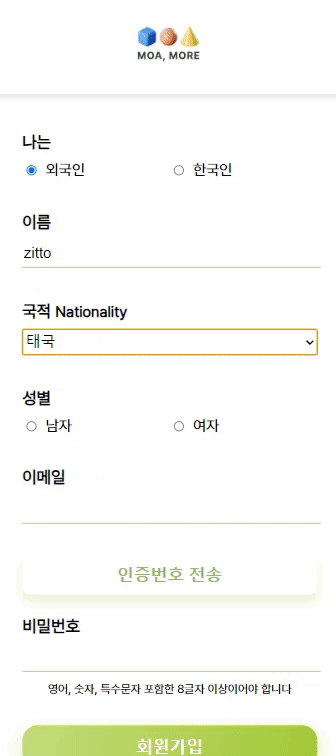
     &nbsp;
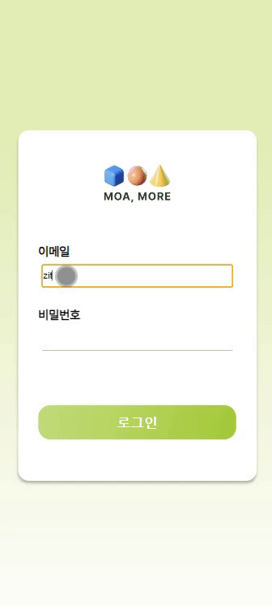

 

- 회원가입시 한국인/외국인, 이름, 국적, 이메일, 비밀번호를 등록한다.
- 회원가입 후 로그인으로 서비스 이용이 가능하다.

 

### 뉴스

    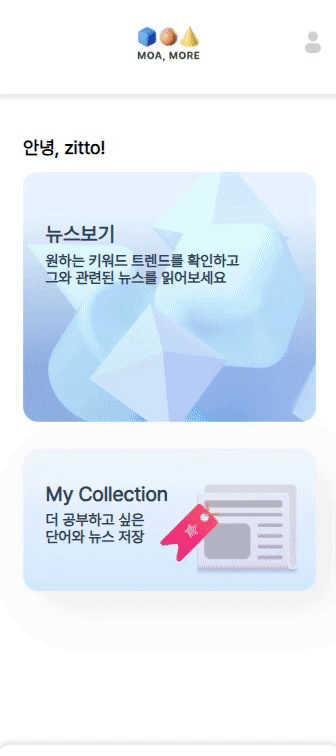
    &nbsp;
    
    &nbsp;
    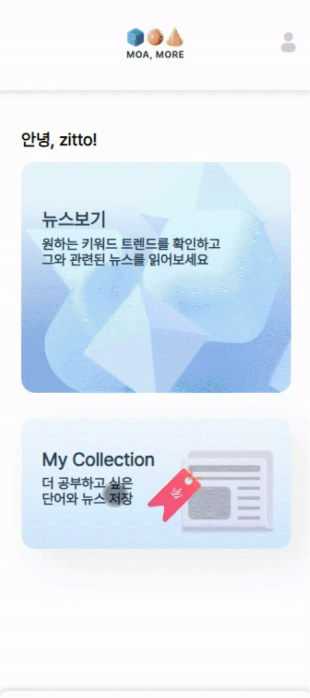

 

- 오늘 뉴스에서 많이 언급된 단어를 워드클라우드로 쉽게 볼 수 있다.
- 뉴스 기사를 문장 단위로 영어, 한국어 해석을 동시에 볼 수 있다.
- 뉴스를 문장 단위로 읽을 수 있으며, 해당 뉴스를 스크랩할 수 있다.
- 하이라이트된 주요 단어를 클릭하면 뜻을 알 수 있고, 심화로 chat GPT에게 질문하여 더 자세한 뜻을 알 수 있다.
- 공부하며 저장한 단어와 뉴스를 확인할 수 있다.

 

### 퀴즈

    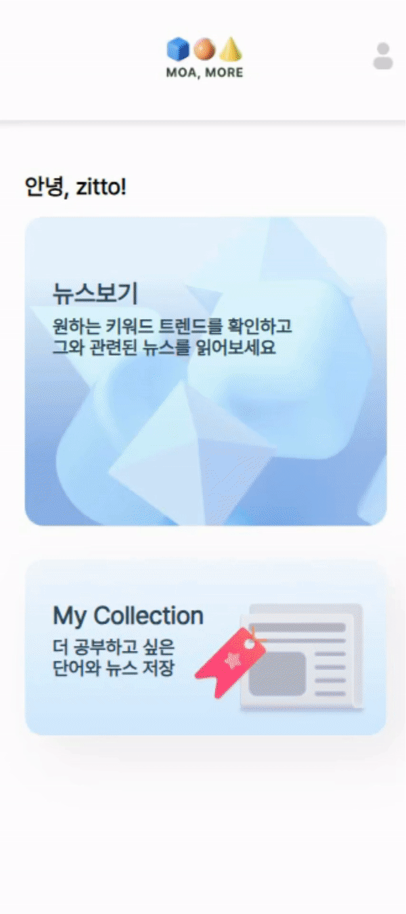
    &nbsp;
    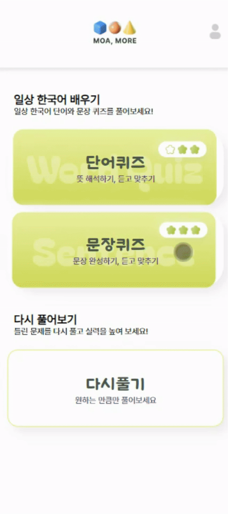
    &nbsp;
    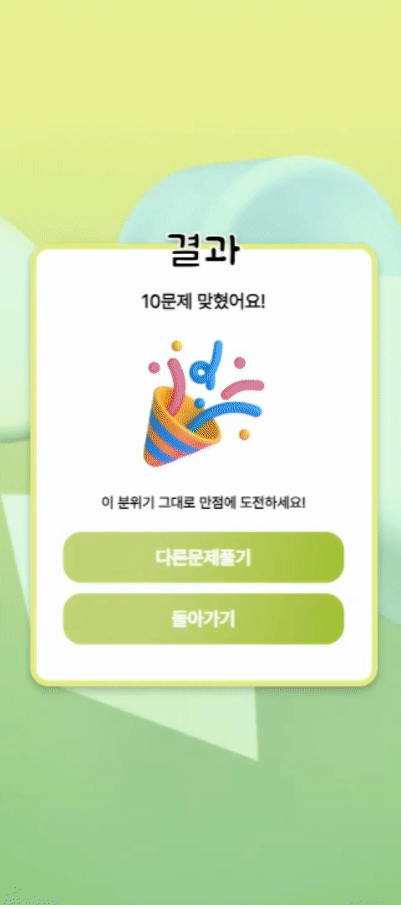

 

- 공부하며 저장한 단어와 뉴스를 확인할 수 있다.
- 일상에서 쓰이는 말뭉치 데이터를 통해 단어퀴즈, 문장퀴즈를 풀 수 있다.
- [단어퀴즈] 영어 단어를 보고 한국어 뜻 맞추기, 한국어 소리를 듣고 뜻 맞추기 종류의 퀴즈를 랜덤으로 15개 풀 수 있다.
- [문장퀴즈] 영어 문장을 본 후 한국어 문장 순서 맞추기, 듣고 한국어 문장 순서 맞추기 종류의 퀴즈를 랜덤으로 15개 풀 수 있다.
- [오답노트] 틀린 문제 풀이를 통해 내가 모르는 단어와 문장을 다시 복습할 수 있다.

 

### 교환일기

    
    &nbsp;
    

 

- 버디와 매칭된 상태라면 교환일기를 이용할 수 있다.
- [교환일기 조회] 한 눈에 교환일기를 달 단위로 볼 수 있으며, 날짜를 클릭하면 그 날에 쓴 버디와 나의 일기를 조회할 수 있다.
- [교환일기 등록] 오늘 일기를 쓰지 않았다면 사진과 버디에게 하고 싶은 말을 담아 일기를 쓸 수 있다.

 

### 밸런스게임

    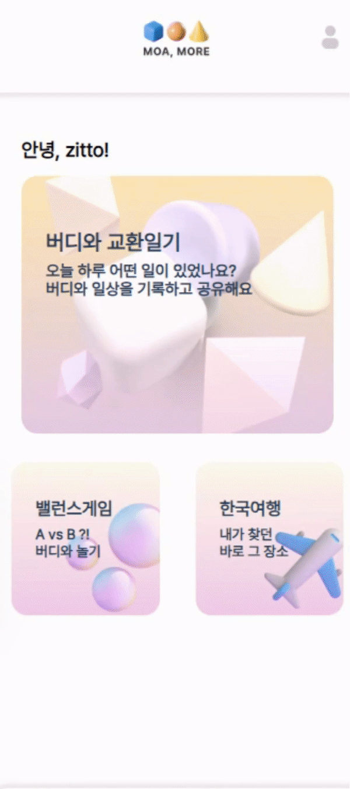
    &nbsp;
    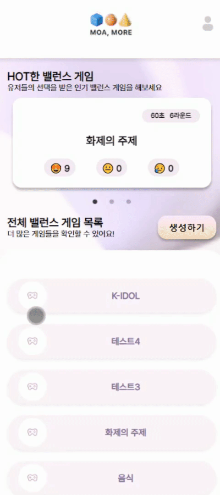

 

- 버디와 밸런스게임을 통해 서로의 취향을 공유하며 더욱 가까워질 수 있다.
- 외국인 버디는 밸런스게임을 통한 새로운 한국어를 학습할 수 있다.

 

### 한국 문화 탐방

    
    &nbsp;
    

 

- 외국인 이용자는 한국 미디어 콘텐츠(K-Drama, K-POP)을 검색하여 해당 미디어에 노출된 장소 정보를 볼 수 있다.

 

### 채팅

    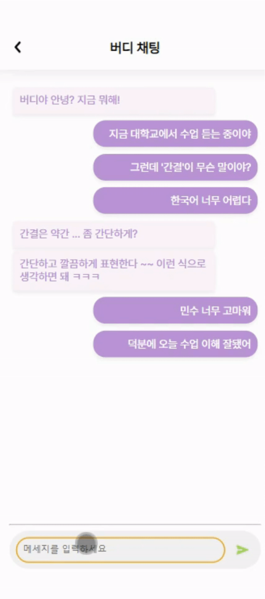
    &nbsp;
    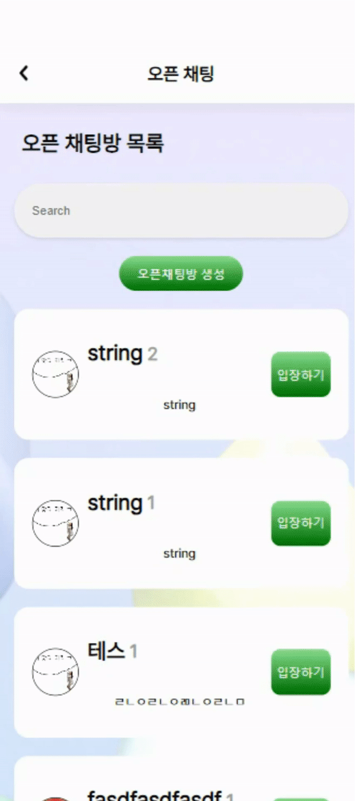

 

- 버디와 함께 1:1 채팅이 가능하다.
- 오픈 채팅을 통해 다양한 국적의 사람들과 한국에서의 팁을 공유할 수 있다.

 

