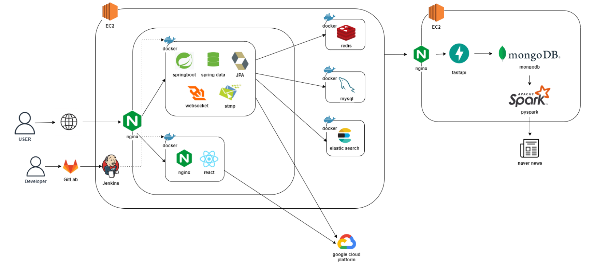
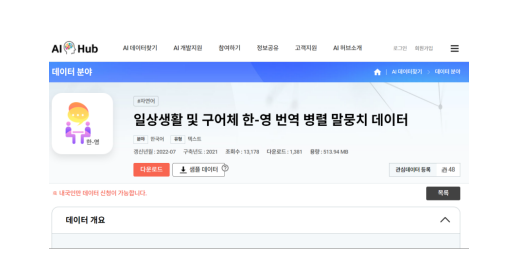
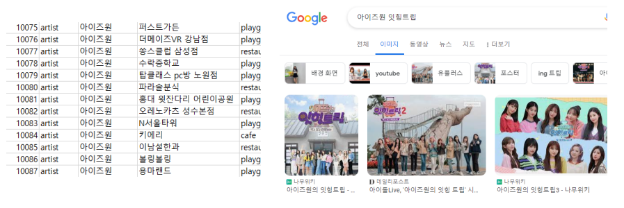

# 
  프로젝트 소개 

- 제작기간 : 2023년 8월 28일 (MON) ~ 2023년 10월 6일(FRI)
- 프로젝트 주제: 빅데이터 분산 기술을 활용한 외국인 유학생 한국 온보딩 서비스
- 팀 명: 홍홍홍
- 서비스명: *MOA(모아)*

## 팀원 소개
### 이진형
- 팀장
- FrontEnd
- UI/UX

### 노창현
- FrontEnd
- Data

### 박진희
- FrontEnd
- 디자인 및 UI/UX

### 이하린
- BackEnd
- FrontEnd - 뉴스, 교환일기

### 정효인
- BackEnd, Infra
- FrontEnd - 한국여행

### 황주원
- BackEnd
- FrontEnd - 뉴스

## ERD

## ARCHITECTURE

## 서비스 소개
## 1. 모아 보는 한글
### 한국 뉴스 학습
- 최신 뉴스 기반 트렌드 어휘 학습
- 당일 기사에서 언급된 단어를 워드 클라우드 형태로 확인
- 단어 상세보기를 통해 해석, AI에게 묻기, 발음 듣기, 용례, 관련 기사 확인
- 기사 상세보기에서 한글, 영어 뉴스 모두 확인
- 문장 듣기 및 스크랩 기능 제공
- 단어 클릭 시 해석 확인, GPT 및 버디에게 묻기
### 한국 어휘 학습
- 말뭉치 데이터 기반 퀴즈
- 단어 퀴즈, 문장 퀴즈 2가지 모드 제공
    - 문장퀴즈: 어순에 맞춰 주어진 단어 나열
- 다시 풀기 기능을 통해 틀린문제 복습

## 2. More Friendly 한국
- 교환일기, 밸런스게임, 한국여행 기능 제공
- 교환일기
    - 버디와 교환일기 작성
    - 날짜별 버디 / 나의 작성 기록 확인
    - 사진과 글을 통해 버디와 추억 공유
- 밸런스 게임
    - 사용자 평가에 따른 밸런스 게임 주제 선택
    - 전체 목록 확인 및 생성 기능
- 한국 여행
    - 한류 관련 명소 정보 제공
- 채팅
    - 버디와의 1:1 채팅 기능
    - 다른 사람들과 함께 소통 가능한 오픈 채팅 기능

## 주요 기술
### 빅데이터
- requests 및 beautifulsoup를 활용한 네이버 기사 정보 크롤링
- KoNLPy 활용 -> 한국어 자연어처리 라이브러리, 형태소 분석을 통한 단어 분리, 자체 제작 불용어 사전으로 단어 필터링
- 빅데이터 분산처리 시스템 -> 낮은 자원으로 연산 효율 ↑, 확장용이성 ↑
- 빅데이터 분산처리 파이프라인

- DAG(Directed Acyclic Graph) : Task 간 의존성 설정을 통해 데이터 ETL(Extract - Transform - Load) 과정의 무결성 보장

### 백엔드
- 자연어 처리를 통한 말뭉치 데이터 형태소를 분석하여 퀴즈 제공

  

- Selenium 활용
    - 이미지 정보 제공을 위해 키워드 구글 검색으로 이미지 파일 크롤링

    

- ElasticSearch
    - 역색인(Inverted Index)을 통해 특정 문자열 검색 속도를 비약적으로 향상
    - nori, ngram을 사용하여 형태소 분석의 정확도를 높임
    - 복잡한 한글에 최적화된 검색 엔진

### 프론트엔드
- WebSocket & Stomp를 활용하여 실시간 채팅 구현
- API 모듈화로 재사용성 용이
